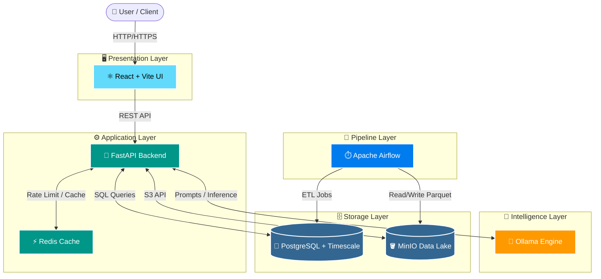

# 🚀 StatIQ / MoSPI Platform


> **Modern, Containerized, and AI-Driven Data Platform.**

---

## ✨ Key Features & Functionalities

- 🔐 **Secure Access & Auth**: JWT-based authentication, RSA key pairs, and role-based access.
- ⚡ **High-Performance API**: Built on FastAPI for rapid response, async processing, and scalability.
- 🧠 **Local AI Engine**: Integrated Ollama for secure, local AI model execution (no external API needed).
- 📊 **Time-Series Ready DB**: PostgreSQL optimized with TimescaleDB for massive data handling.
- 📦 **S3-Compatible Data Lake**: MinIO object storage for raw files, Parquet, and processed datasets.
- 🔄 **ETL Orchestration**: Apache Airflow pipelines for automated data ingestion and scheduling.
- 🚀 **Blazing Fast Cache**: Redis 7 implementation for rate limiting and NL-SQL caching.
- 💻 **Modern Frontend UI**: React + Vite application served via Nginx for a snappy user experience.
- ✉️ **Automated Mailing**: Integrated SMTP (Brevo) for alerts and notifications.
- 🛡️ **Audit Logging**: Comprehensive action tracking and security event logging.
- 🛠️ **Visual DB Management**: pgAdmin included out-of-the-box for database administration.

---

## 🏗️ Architecture Layer Diagram



---

## 💻 System Requirements

**Hardware Requirements**
*   **RAM**: 8GB Minimum 🚀 *(16GB Recommended due to AI & Airflow)*
*   **CPU**: 4 Cores Minimum
*   **Storage**: 20GB+ Free Space

**Software Prerequisites**
*   🐳 [Docker (v20.10+)](https://docs.docker.com/get-docker/) & Docker Compose
*   🌿 [Git](https://git-scm.com/downloads)

---

## 🚀 Quick Start (Docker)

Get the entire stack up and running locally in a few simple steps:

1. **Clone the Repository**
   ```bash
   git clone <repository_url> mospi-platform
   cd mospi-platform
   ```

2. **Configure Environment**
   ```bash
   cp .env.example .env
   ```
   > 📝 *Open `.env` and configure any required API keys or secrets (e.g., `JWT_SECRET`).*

3. **Launch the Platform**
   ```bash
   docker-compose up -d
   ```
   > ⏳ *Note: The initial setup may take several minutes as it downloads large Docker images (PostgreSQL, Airflow, Ollama, etc.) and builds the containers.*

4. **Verify Deployment**
   ```bash
   docker-compose ps
   ```

---

## 🌐 Services & Endpoints

Access your local stack using the following portals:

| Service | Address | Default Credentials / Information |
|:---|:---|:---|
| 🎨 **Frontend UI** | `http://localhost:3000` | Main User Interface |
| 🔌 **Backend API** | `http://localhost:8000` | Core API Layer |
| 🐘 **pgAdmin Viewer** | `http://localhost:5050` | `admin@statiq.com` / `admin` |
| 🪣 **MinIO Console**| `http://localhost:9001` | `statiq` / `statiq123` |
| ⏱️ **Airflow UI** | `http://localhost:8080` | `admin` / `admin` |
| 🤖 **Ollama Engine** | `http://localhost:11434`| Local AI Model Engine API |
| 🗄️ **TimescaleDB** | `localhost:5434` | `statiq` / `statiq123` / DB: `statiq` |
| ⚡ **Redis** | `localhost:6379` | Cache & Rate Limiting |

---

## 🛠️ Local Development (Optional)

If you prefer to run the application components outside of Docker:

### Backend (Python API)
> 🐍 *Requires Python 3.10+*
```bash
pip install -r requirements.txt
uvicorn api.main:app --reload --port 8000
```

### Frontend (React + Vite)
> 🟢 *Requires Node.js (v18+)*
```bash
cd frontend
npm install
npm run dev
```

---

## ⚙️ Lifecycle Management

Quick commands to manage your running platform containers:

*   **Stop Safely**: 
    ```bash
    docker-compose down
    ```
*   **Wipe All Data** ⚠️ *(Warning: Deletes database & MinIO volumes!)*: 
    ```bash
    docker-compose down -v
    ```
*   **Restart Specific Service** *(Example: Frontend)*: 
    ```bash
    docker-compose restart frontend
    ```
*   **Rebuild Images After Code Changes**: 
    ```bash
    docker-compose up -d --build
    ```
